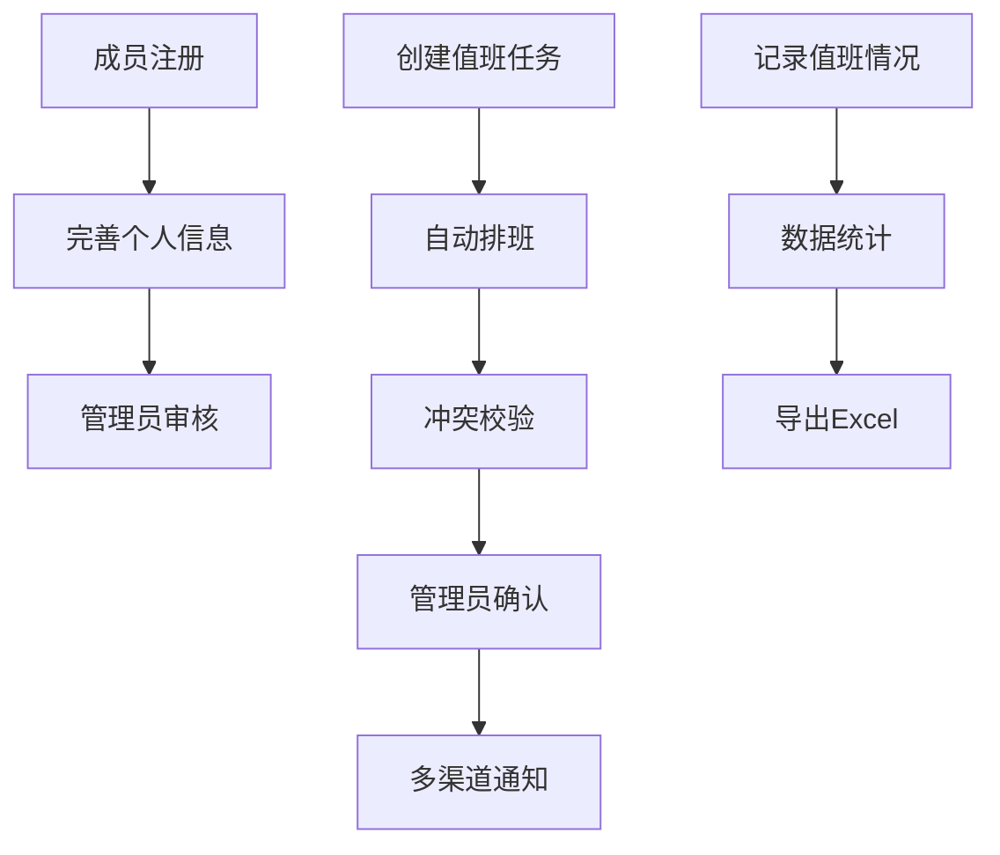

## 1. 产品概述
校园智能排班与通知系统是一款面向大学生社团、学生会、班级的智能排班工具，解决传统排班效率低、通知不及时等问题。
- 主要功能包括成员管理、排班管理、通知管理和数据统计，旨在提高组织运营效率，确保任务顺利完成。
- 目标用户为高校学生组织，市场价值在于提升组织管理水平，减少人工排班工作量。

## 2. 核心功能

### 2.1 用户角色
| 角色 | 注册方式 | 核心权限 |
|------|---------------------|------------------|
| 普通成员 | 邮箱注册 | 查看排班、提交空闲时间、查看个人统计 |
| 部门管理员 | 邀请码注册 | 管理部门成员、创建值班任务、审批排班 |
| 系统管理员 | 后台创建 | 管理所有部门、用户和系统配置 |

### 2.2 功能模块
1. **登录/注册页面**：用户认证、角色区分
2. **成员管理页面**：成员信息管理、空闲时间录入、特长标注
3. **排班管理页面**：任务创建、自动排班、冲突校验
4. **通知管理页面**：多渠道通知设置、通知历史
5. **数据统计页面**：值班次数统计、出勤情况、志愿时长导出

### 2.3 页面详情
| 页面名称 | 模块名称 | 功能描述 |
|-----------|-------------|---------------------|
| 登录/注册页面 | 登录模块 | 支持邮箱登录、密码找回 |
| 登录/注册页面 | 注册模块 | 支持邮箱注册、邀请码验证 |
| 成员管理页面 | 成员列表 | 查看部门成员信息、编辑成员状态 |
| 成员管理页面 | 个人信息 | 编辑个人资料、录入空闲时间、标注特长和优先级 |
| 排班管理页面 | 任务创建 | 手动输入值班任务类型、时间、人数要求 |
| 排班管理页面 | 自动排班 | 系统根据成员空闲时间自动匹配，进行冲突校验 |
| 排班管理页面 | 排班结果 | 查看排班详情、手动调整、确认发布 |
| 通知管理页面 | 通知设置 | 配置微信、企业微信、校园邮箱通知渠道 |
| 通知管理页面 | 通知历史 | 查看历史通知记录、发送状态 |
| 数据统计页面 | 部门统计 | 统计各部门值班次数、出勤率 |
| 数据统计页面 | 个人统计 | 统计成员出勤情况、志愿时长 |
| 数据统计页面 | 导出功能 | 导出Excel表格格式的统计数据 |

## 3. 核心流程
### 成员注册与信息完善流程
1. 用户通过邮箱注册账号
2. 系统根据邀请码分配角色
3. 成员完善个人资料，录入空闲时间和特长
4. 管理员审核成员信息

### 排班流程
1. 管理员创建值班任务，设置任务类型、时间、人数要求
2. 系统根据成员空闲时间、特长和优先级自动匹配
3. 系统进行冲突校验，避免重复排班和时间冲突
4. 管理员确认排班结果
5. 系统通过多渠道发送通知给相关成员

### 数据统计流程
1. 系统自动记录值班情况
2. 管理员查看部门和个人统计数据
3. 导出Excel表格用于分析和存档

## 4. 用户界面设计
### 4.1 设计风格
- 主色调：蓝色系 (#1E88E5) 和白色 (#FFFFFF)，体现校园青春活力
- 辅助色：浅灰 (#F5F5F5)、深灰 (#424242)
- 按钮样式：圆角矩形，有轻微阴影效果
- 字体：系统默认无衬线字体，标题16-20px，正文14px
- 布局风格：卡片式布局，顶部导航栏
- 图标风格：线性图标，简洁明了

### 4.2 页面设计概览
| 页面名称 | 模块名称 | UI元素 |
|-----------|-------------|-------------|
| 登录/注册页面 | 登录模块 | 简洁表单，包含邮箱、密码输入框，登录按钮，忘记密码链接 |
| 登录/注册页面 | 注册模块 | 包含邮箱、密码、确认密码输入框，邀请码输入框，注册按钮 |
| 成员管理页面 | 成员列表 | 表格形式展示成员信息，支持搜索和筛选，每行包含编辑、删除按钮 |
| 成员管理页面 | 个人信息 | 表单形式，包含基本信息、空闲时间选择器、特长标签选择、优先级设置 |
| 排班管理页面 | 任务创建 | 表单形式，包含任务类型下拉选择、时间选择器、人数输入框、任务描述 |
| 排班管理页面 | 排班结果 | 日历视图展示排班情况，支持拖拽调整，冲突显示为红色 |
| 通知管理页面 | 通知设置 | 开关按钮控制各通知渠道，输入框配置通知模板 |
| 通知管理页面 | 通知历史 | 表格形式展示通知记录，包含发送时间、渠道、状态 |
| 数据统计页面 | 部门统计 | 饼图和柱状图展示各部门值班情况，支持时间范围选择 |
| 数据统计页面 | 个人统计 | 表格形式展示成员出勤情况和志愿时长，支持排序 |
| 数据统计页面 | 导出功能 | 导出按钮，支持选择导出范围和格式 |

### 4.3 响应性
- 设计采用桌面端优先，同时支持移动端自适应
- 移动端采用底部导航栏，简化操作流程
- 触摸优化：按钮和可点击元素尺寸不小于44px×44px