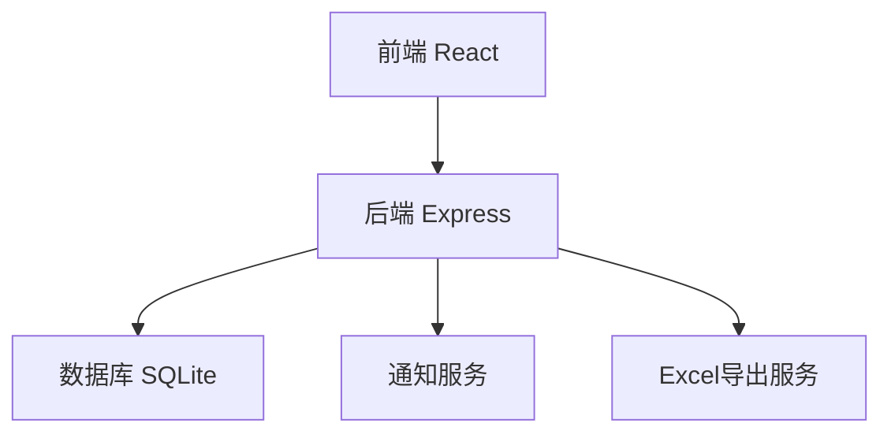
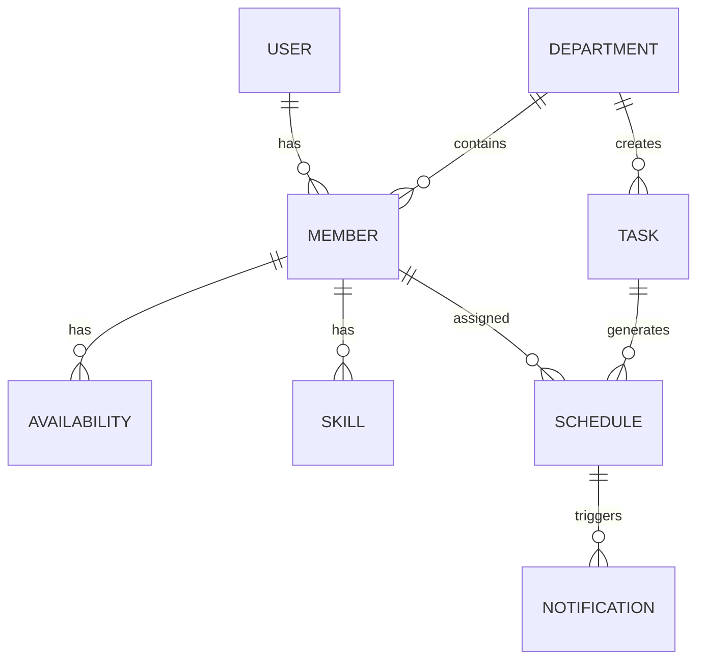

## 1. 架构设计


## 2. 技术描述
- 前端：React@18 + tailwindcss@3 + vite
- 后端：Express@4 + Node.js
- 数据库：SQLite
- 认证：JWT
- 通知：微信API、企业微信API、邮件服务
- 导出：ExcelJS

## 3. 路由定义
| 路由 | 用途 |
|-------|---------|
| /login | 登录页面 |
| /register | 注册页面 |
| /dashboard | 仪表盘 |
| /members | 成员管理 |
| /scheduling | 排班管理 |
| /notifications | 通知管理 |
| /statistics | 数据统计 |

## 4. API定义
| API路径 | 方法 | 功能 |
|---------|------|------|
| /api/auth/login | POST | 用户登录 |
| /api/auth/register | POST | 用户注册 |
| /api/members | GET | 获取成员列表 |
| /api/members | POST | 创建成员 |
| /api/members/:id | PUT | 更新成员信息 |
| /api/members/:id | DELETE | 删除成员 |
| /api/tasks | GET | 获取任务列表 |
| /api/tasks | POST | 创建值班任务 |
| /api/tasks/:id | PUT | 更新任务信息 |
| /api/tasks/:id | DELETE | 删除任务 |
| /api/schedules | GET | 获取排班列表 |
| /api/schedules | POST | 生成排班 |
| /api/schedules/:id | PUT | 更新排班 |
| /api/notifications | GET | 获取通知列表 |
| /api/notifications | POST | 发送通知 |
| /api/statistics | GET | 获取统计数据 |
| /api/statistics/export | GET | 导出统计数据 |

## 5. 数据模型
### 5.1 数据模型定义


### 5.2 数据定义语言
```sql
-- 用户表
CREATE TABLE users (
    id INTEGER PRIMARY KEY AUTOINCREMENT,
    email VARCHAR(255) UNIQUE NOT NULL,
    password_hash VARCHAR(255) NOT NULL,
    role VARCHAR(50) NOT NULL,
    created_at TIMESTAMP DEFAULT CURRENT_TIMESTAMP
);

-- 部门表
CREATE TABLE departments (
    id INTEGER PRIMARY KEY AUTOINCREMENT,
    name VARCHAR(100) NOT NULL,
    description TEXT,
    created_at TIMESTAMP DEFAULT CURRENT_TIMESTAMP
);

-- 成员表
CREATE TABLE members (
    id INTEGER PRIMARY KEY AUTOINCREMENT,
    user_id INTEGER REFERENCES users(id),
    department_id INTEGER REFERENCES departments(id),
    name VARCHAR(100) NOT NULL,
    phone VARCHAR(20),
    priority VARCHAR(20),
    created_at TIMESTAMP DEFAULT CURRENT_TIMESTAMP
);

-- 空闲时间表
CREATE TABLE availability (
    id INTEGER PRIMARY KEY AUTOINCREMENT,
    member_id INTEGER REFERENCES members(id),
    day_of_week INTEGER NOT NULL,
    start_time TIME NOT NULL,
    end_time TIME NOT NULL,
    created_at TIMESTAMP DEFAULT CURRENT_TIMESTAMP
);

-- 特长表
CREATE TABLE skills (
    id INTEGER PRIMARY KEY AUTOINCREMENT,
    member_id INTEGER REFERENCES members(id),
    skill_name VARCHAR(100) NOT NULL,
    created_at TIMESTAMP DEFAULT CURRENT_TIMESTAMP
);

-- 任务表
CREATE TABLE tasks (
    id INTEGER PRIMARY KEY AUTOINCREMENT,
    department_id INTEGER REFERENCES departments(id),
    type VARCHAR(50) NOT NULL,
    title VARCHAR(100) NOT NULL,
    description TEXT,
    start_time TIMESTAMP NOT NULL,
    end_time TIMESTAMP NOT NULL,
    required_count INTEGER NOT NULL,
    created_by INTEGER REFERENCES users(id),
    created_at TIMESTAMP DEFAULT CURRENT_TIMESTAMP
);

-- 排班表
CREATE TABLE schedules (
    id INTEGER PRIMARY KEY AUTOINCREMENT,
    task_id INTEGER REFERENCES tasks(id),
    member_id INTEGER REFERENCES members(id),
    status VARCHAR(20) DEFAULT 'assigned',
    created_at TIMESTAMP DEFAULT CURRENT_TIMESTAMP
);

-- 通知表
CREATE TABLE notifications (
    id INTEGER PRIMARY KEY AUTOINCREMENT,
    schedule_id INTEGER REFERENCES schedules(id),
    member_id INTEGER REFERENCES members(id),
    channel VARCHAR(50) NOT NULL,
    content TEXT NOT NULL,
    status VARCHAR(20) DEFAULT 'pending',
    sent_at TIMESTAMP,
    created_at TIMESTAMP DEFAULT CURRENT_TIMESTAMP
);

-- 考勤表
CREATE TABLE attendance (
    id INTEGER PRIMARY KEY AUTOINCREMENT,
    schedule_id INTEGER REFERENCES schedules(id),
    member_id INTEGER REFERENCES members(id),
    status VARCHAR(20) DEFAULT 'absent',
    created_at TIMESTAMP DEFAULT CURRENT_TIMESTAMP
);
```