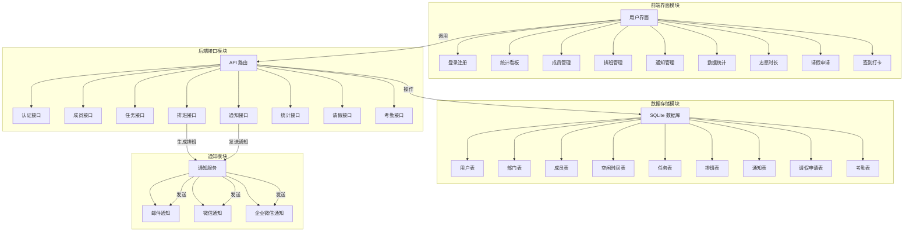

# 校园智能排班与通知系统架构图

## 架构说明

1. **前端界面模块**：
   - 基于 React.js 和 Tailwind CSS 构建
   - 包含多个功能页面：统计看板、成员管理、排班管理、通知管理等
   - 支持响应式设计，适配手机端和电脑端

2. **后端接口模块**：
   - 基于 Express.js 构建 RESTful API
   - 包含 8 个核心路由模块，覆盖系统所有功能
   - 实现了用户认证、数据管理、业务逻辑处理等功能

3. **数据存储模块**：
   - 使用 SQLite 数据库进行数据存储
   - 设计了 9 个核心数据表，存储系统各类数据
   - 实现了表之间的关联关系，确保数据完整性

4. **通知模块**：
   - 支持多种通知渠道：邮件、微信、企业微信
   - 实现了通知发送、状态管理和重新发送功能
   - 与排班系统集成，自动发送排班通知

## 核心功能

- **智能排班**：根据成员空闲时间、优先级、部门归属等因素自动生成排班
- **冲突检测**：实时检查成员时间冲突，避免重复排班
- **通知管理**：支持多渠道通知，确保成员及时收到排班信息
- **数据统计**：提供部门、成员、任务的详细统计数据
- **请假管理**：支持成员请假申请和自动重新排班
- **考勤管理**：记录成员签到情况，统计出勤率
- **志愿时长**：自动累计和统计成员志愿时长

## 技术栈

- **前端**：React.js、Tailwind CSS、React Router
- **后端**：Node.js、Express.js
- **数据库**：SQLite
- **其他**：ExcelJS（Excel 导出）、Nodemailer（邮件发送）